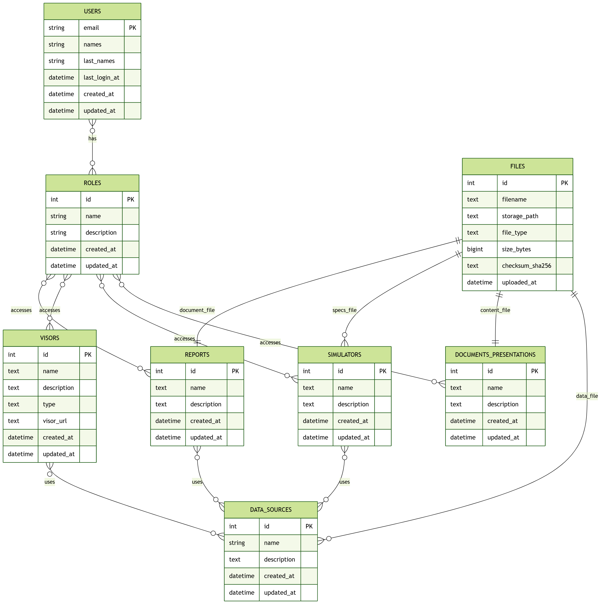

# Database schema

This document summarizes the database schema used in the web application.  
It describes the **core entities**, their responsibilities, and the **conceptual relationships** between them.  
Implementation details such as join tables are explained separately and are **not shown in the E-R diagram**.

---

## Entities & attributes

The main entities and their attributes (concise).  
Relationship / join tables are intentionally omitted here for clarity and are described in the *Relationships* section.

| Table | Description |
|------|-------------|
| **roles** | Stores system roles with a unique ID, name, optional description, and creation/update timestamps. |
| **users** | Stores users identified by email, including first and last names, last login timestamp, and creation/update timestamps. |
| **files** | Centralized storage metadata for all uploaded files, including filename, storage path, type, size, checksum, and upload timestamp. |
| **simulators** | Represents simulators available in the system, with name, description, and an optional reference to a specifications file. |
| **visors** | Represents data visualization tools, including name, description, type and an optional external URL. |
| **reports** | Represents reports with name, description, and an optional reference to a document file. |
| **documents_presentations** | Stores general documents or presentations, linked to a single stored file. |
| **data_sources** | Represents data sources used by reports, visors, and simulators; each data source references exactly one stored file and includes timestamps. |

---

## Relationships (conceptual)

The relationships below describe the **logical model**.  
Many-to-many relationships are implemented using join tables in the database but are described conceptually here.

- **Users ↔ Roles**  
  A user may have multiple roles, and a role may be assigned to multiple users.

- **Roles ↔ Resources (RBAC)**  
  Roles control access to system resources:
  - roles ↔ reports  
  - roles ↔ visors  
  - roles ↔ simulators  
  - roles ↔ documents_presentations  

- **Files ↔ Resources**  
  The `files` table acts as a centralized storage abstraction:
  - a report may reference one document file  
  - a simulator may reference one specifications file  
  - a document/presentation references exactly one file  
  - a data source references exactly one file  

- **Data sources ↔ Resources**  
  Data sources can be reused across the system:
  - reports ↔ data_sources (many-to-many)  
  - visors ↔ data_sources (many-to-many)  
  - simulators ↔ data_sources (many-to-many)  

- **Integrity constraint**  
  A file referenced by a data source cannot be deleted (`ON DELETE RESTRICT`), preventing accidental data loss.

---

## Conventions & design notes

- Most core tables use `SERIAL` integer primary keys.
- `users.email` is used as the primary key for users instead of a numeric ID.
- Many-to-many relationships are implemented using dedicated join tables with composite primary keys.
- Timestamps commonly default to `NOW()` (`created_at`, `updated_at`, `uploaded_at`).
- The `files` table centralizes all file metadata, avoiding duplication and simplifying file lifecycle management.
- The E-R diagram represents the **conceptual model**, not the physical implementation of join tables.

---

## E-R diagram

